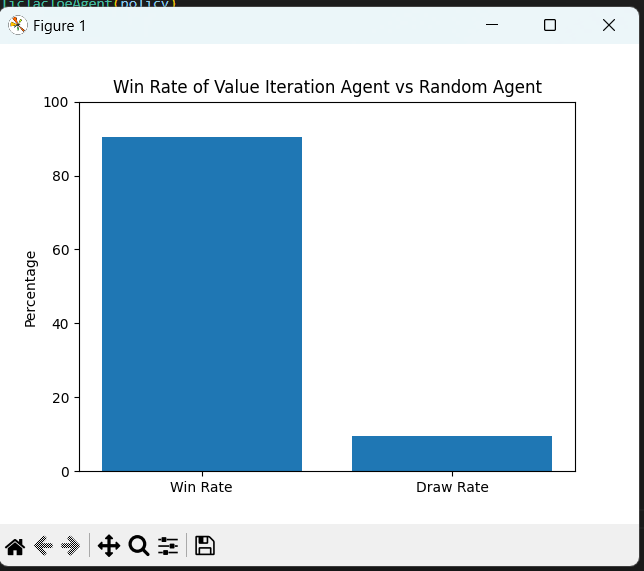

Value Iteration Algorithm for Tic Tac Toe

This project implements the Value Iteration algorithm for playing Tic Tac Toe. It allows agents to learn optimal strategies and play against each other or against a human player.

Getting Started

Prerequisites

Make sure you have the following installed:

- Python 3.x
- Required libraries (if any) - e.g., tkinter, matplotlib, etc.

Running the Project

1. Train the Agents  
   Run the following command to train the agents:
   python train_agents.py

2. Start the Tic Tac Toe Game  
   Launch the Tic Tac Toe game with:
   python TicTacToe.py

Visual Representation

